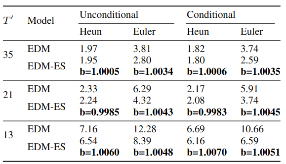
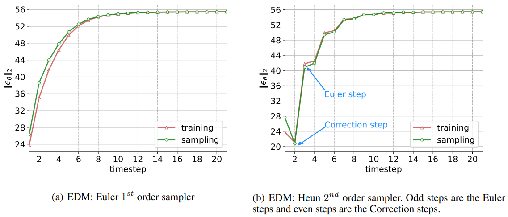

## Elucidating the Exposure Bias in Diffusion Models
This is the codebase for our paper **Elucidating the Exposure Bias in Diffusion Models**
<br>https://arxiv.org/abs/2308.15321

The repository is heavily based on [EDM](https://github.com/NVlabs/edm) with the sampling solution **Epsion Scaling** (EDM-ES) 
Feel free to check out our Epsilon Scaling repository for ADM: [ADM-ES](https://github.com/forever208/ADM-ES) 


## Installsation
The installation is the same as EDM
* Linux and Windows are supported, but we recommend Linux for performance and compatibility reasons.
* 1+ high-end NVIDIA GPU for sampling and 8+ GPUs for training. We have done all testing and development using V100 and A100 GPUs.
* Python 3.8 and PyTorch 1.12.0 are recommended
* Python libraries: See [environment.yml](./environment.yml) for exact library dependencies. You can use the following commands with Anaconda to create and activate your Python environment:
  - `conda env create -f environment.yml -n edm`
  - `conda activate edm`


## Download Pre-trained models
Since EDM-ES is a ssampling solution, we use the pre-trained models from EDM without any change.
EDM provides pre-trained models below:

- [https://nvlabs-fi-cdn.nvidia.com/edm/pretrained/](https://nvlabs-fi-cdn.nvidia.com/edm/pretrained/)
- [https://nvlabs-fi-cdn.nvidia.com/edm/pretrained/baseline/](https://nvlabs-fi-cdn.nvidia.com/edm/pretrained/baseline/)


## Generating images
Epsilon Scaling is implemented in `generate.py` script.
<br> `--eps_scaler=1.0` correcponds to the EDM baseline.
<br>The default ODE sampler is Heun 2nd order sampler.


For example, using EDM-ES to generate 50000 images (set --seeds=0-49999) with 35-step Heun sampler:
```.bash
torchrun --standalone --nnodes=1 --nproc_per_node=1 generate.py \
    --outdir=out --batch 512 --steps=18 --seeds=0-49999 \
    --eps_scaler=1.0006 \
    --network=https://nvlabs-fi-cdn.nvidia.com/edm/pretrained/edm-cifar10-32x32-cond-vp.pkl
```

using EDM-ES to generate 50000 images (set --seeds=0-49999) with 13-step Euler sampler:
```.bash
torchrun --standalone --nnodes=1 --nproc_per_node=1 generate.py \
    --outdir=out --batch 512 --steps=13 --seeds=0-49999 --solver=euler \
    --eps_scaler=1.0048 \
    --network=https://nvlabs-fi-cdn.nvidia.com/edm/pretrained/edm-cifar10-32x32-uncond-vp.pkl
```

The full parameter settings of `--eps_scaler` is shown below:

<p align="left">
  
</p>


## Trajectory of Epsilon L2-norm  
If you want to plot the Epsilon L2-norm (similar to Fig. 6 in the paper), checkout into branch `eps_norm_consecutive_sampling` and `eps_norm_single_step_sampling`.
In which the former compute the Epsilon L2-norm during regular sampling, while the latter compute the Epsilon L2-norm during training (more specifically, given a well-trained model)

<p align="left">
  
</p>

## Calculating FID

To compute Fr&eacute;chet inception distance (FID) for a given model and sampler, first generate 50,000 random images and then compare them against the dataset reference statistics using `fid.py`:

```.bash
# Generate 50000 images and save them as fid-tmp/*/*.png
torchrun --standalone --nproc_per_node=1 generate.py --outdir=fid-tmp --seeds=0-49999 --subdirs \
    --network=https://nvlabs-fi-cdn.nvidia.com/edm/pretrained/edm-cifar10-32x32-cond-vp.pkl

# Calculate FID
torchrun --standalone --nproc_per_node=1 fid.py calc --images=fid-tmp \
    --ref=https://nvlabs-fi-cdn.nvidia.com/edm/fid-refs/cifar10-32x32.npz
```

Both of the above commands can be parallelized across multiple GPUs by adjusting `--nproc_per_node`. The second command typically takes 1-3 minutes in practice, but the first one can sometimes take several hours, depending on the configuration. See [`python fid.py --help`](./docs/fid-help.txt) for the full list of options.

Note that the numerical value of FID varies across different random seeds and is highly sensitive to the number of images. By default, `fid.py` will always use 50,000 generated images; providing fewer images will result in an error, whereas providing more will use a random subset. To reduce the effect of random variation, we recommend repeating the calculation multiple times with different seeds, e.g., `--seeds=0-49999`, `--seeds=50000-99999`, and `--seeds=100000-149999`. In our paper, we calculated each FID three times and reported the minimum.

Also note that it is important to compare the generated images against the same dataset that the model was originally trained with. To facilitate evaluation, we provide the exact reference statistics that correspond to our pre-trained models:

* [https://nvlabs-fi-cdn.nvidia.com/edm/fid-refs/](https://nvlabs-fi-cdn.nvidia.com/edm/fid-refs/)

For ImageNet, we provide two sets of reference statistics to enable apples-to-apples comparison: `imagenet-64x64.npz` should be used when evaluating the EDM model (`edm-imagenet-64x64-cond-adm.pkl`), whereas `imagenet-64x64-baseline.npz` should be used when evaluating the baseline model (`baseline-imagenet-64x64-cond-adm.pkl`); the latter was originally trained by Dhariwal and Nichol using slightly different training data.

You can compute the reference statistics for your own datasets as follows:

```.bash
python fid.py ref --data=datasets/my-dataset.zip --dest=fid-refs/my-dataset.npz
```

## Preparing datasets

Datasets are stored in the same format as in [StyleGAN](https://github.com/NVlabs/stylegan3): uncompressed ZIP archives containing uncompressed PNG files and a metadata file `dataset.json` for labels. Custom datasets can be created from a folder containing images; see [`python dataset_tool.py --help`](./docs/dataset-tool-help.txt) for more information.

**CIFAR-10:** Download the [CIFAR-10 python version](https://www.cs.toronto.edu/~kriz/cifar.html) and convert to ZIP archive:

```.bash
python dataset_tool.py --source=downloads/cifar10/cifar-10-python.tar.gz \
    --dest=datasets/cifar10-32x32.zip
python fid.py ref --data=datasets/cifar10-32x32.zip --dest=fid-refs/cifar10-32x32.npz
```

**FFHQ:** Download the [Flickr-Faces-HQ dataset](https://github.com/NVlabs/ffhq-dataset) as 1024x1024 images and convert to ZIP archive at 64x64 resolution:

```.bash
python dataset_tool.py --source=downloads/ffhq/images1024x1024 \
    --dest=datasets/ffhq-64x64.zip --resolution=64x64
python fid.py ref --data=datasets/ffhq-64x64.zip --dest=fid-refs/ffhq-64x64.npz
```

**AFHQv2:** Download the updated [Animal Faces-HQ dataset](https://github.com/clovaai/stargan-v2/blob/master/README.md#animal-faces-hq-dataset-afhq) (`afhq-v2-dataset`) and convert to ZIP archive at 64x64 resolution:

```.bash
python dataset_tool.py --source=downloads/afhqv2 \
    --dest=datasets/afhqv2-64x64.zip --resolution=64x64
python fid.py ref --data=datasets/afhqv2-64x64.zip --dest=fid-refs/afhqv2-64x64.npz
```

**ImageNet:** Download the [ImageNet Object Localization Challenge](https://www.kaggle.com/competitions/imagenet-object-localization-challenge/data) and convert to ZIP archive at 64x64 resolution:

```.bash
python dataset_tool.py --source=downloads/imagenet/ILSVRC/Data/CLS-LOC/train \
    --dest=datasets/imagenet-64x64.zip --resolution=64x64 --transform=center-crop
python fid.py ref --data=datasets/imagenet-64x64.zip --dest=fid-refs/imagenet-64x64.npz
```


## Citation

```
@article{ning2023elucidating,
  title={Elucidating the Exposure Bias in Diffusion Models},
  author={Ning, Mang and Li, Mingxiao and Su, Jianlin and Salah, Albert Ali and Ertugrul, Itir Onal},
  journal={arXiv preprint arXiv:2308.15321},
  year={2023}
}
```

If you want to know our training solution to exposure bias, feel free to check out our ICML 2023 paper and [repository](https://github.com/forever208/DDPM-IP):
```
@article{ning2023input,
  title={Input Perturbation Reduces Exposure Bias in Diffusion Models},
  author={Ning, Mang and Sangineto, Enver and Porrello, Angelo and Calderara, Simone and Cucchiara, Rita},
  journal={arXiv preprint arXiv:2301.11706},
  year={2023}
}
```